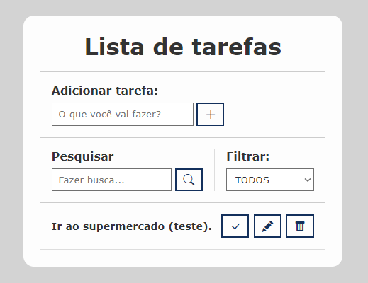

## Sobre

Projeto <strong>todo</strong>, um projeto desafiador que um "principiante" ainda não consegue fazer, mas que contribui muito no aprendizado.

## Todo

O projeto é desafiador, desta vez, fiz com ajuda da video aula <em>Projeto de JavaScript para iniciantes - To Do List com JavaScript puro</em>.

- HTML Semântico
- Seletores CSS e posicionamento de elementos,
- Métodos de seleção de elementos do DOM,
- Escuta de eventos e manipulação de elementos com JavaScript,
- Modificação de atributos e classes dos elementos HTML, e
- Utilização do Web Storage.

Apenas os botões de "criar nova tarefa", "marcar como feito", "editar", "excluir" e "cancelar" estão funcionando.

<em>"Aprender a utilizar o JavaScript vanilla e o DOM é necessário para qualquer desenvolvedor, isso possibilita o aprendizado facilitado em: React, Vue e Angular. Que são outros frameworks muito utilizados nas grandes empresas"</em>

<strong>Pretendo adquirir mais conhecimento e voltar a fazer esse projeto desafiador, mas com bootstrap e dessa vez tentando fazer "por mim mesmo".</strong>
  

    

 

<h1 align="center"><a href="https://felilpz.github.io/todo-list/">IR PARA PÁGINA</a></h1>